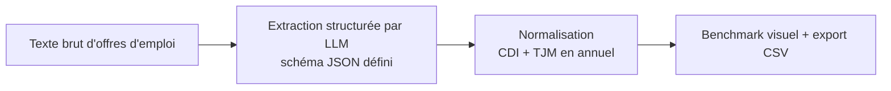

# Playbook — Benchmark Salarial IA

> Guide opératoire structuré en 4 volets (Définitions / Process / Documentation / Templates).
> Voir [`README.md`](README.md) pour le contexte complet.

---

## 1. Définitions

| Terme | Définition |
|---|---|
| **BYOK** | Bring Your Own Key — l'utilisateur fournit sa propre clé API Anthropic, jamais stockée |
| **Score d'attractivité** | Note synthétique par offre, calculée à partir des critères extraits |
| **Normalisation annuelle** | Conversion des TJM freelance et salaires CDI vers une base annuelle comparable |

## 2. Process

1. **Collecte** — texte brut copié depuis LinkedIn/Indeed/WTTJ, aucun scraping.
2. **Extraction IA** — un prompt avec schéma JSON strict extrait fourchettes salariales, compétences, SIRH mentionnés.
3. **Normalisation** — CDI et TJM freelance ramenés sur une base annuelle comparable, condition nécessaire pour un vrai benchmark.
4. **Restitution** — comparatif visuel + export CSV compatible Excel FR, prêt pour intégration dans un outil C&B existant.

**Point de décision réutilisable** : imposer un schéma JSON strict au LLM plutôt que de parser du texte libre — rend l'extraction fiable et reproductible, pas dépendante de la formulation exacte de chaque offre.

## 3. Documentation

- [`README.md`](README.md) — cas d'usage C&B, mode démo, comment adapter le schéma d'extraction
- [`PROMPT_LOG.md`](PROMPT_LOG.md) — trace complète des prompts et décisions d'architecture

## 4. Templates réutilisables

- **Le schéma JSON d'extraction** (`app.py` ligne ~60) — pattern directement réutilisable pour extraire n'importe quelle donnée structurée depuis du texte libre (pas seulement des offres d'emploi).
- **Le pattern BYOK** — clé API saisie en sidebar, jamais stockée : réutilisable pour tout outil IA distribué publiquement sans exposer de coût API à l'auteur.

**Règle de transposition** : pour un vrai client, changer le schéma JSON et les critères du score d'attractivité selon ses priorités — l'extraction et la normalisation restent identiques quel que soit le secteur.

---

*Gisèle Metouck — Consultante Data Steward & Gouvernance · [GitHub](https://github.com/Kingdmfncr)*
